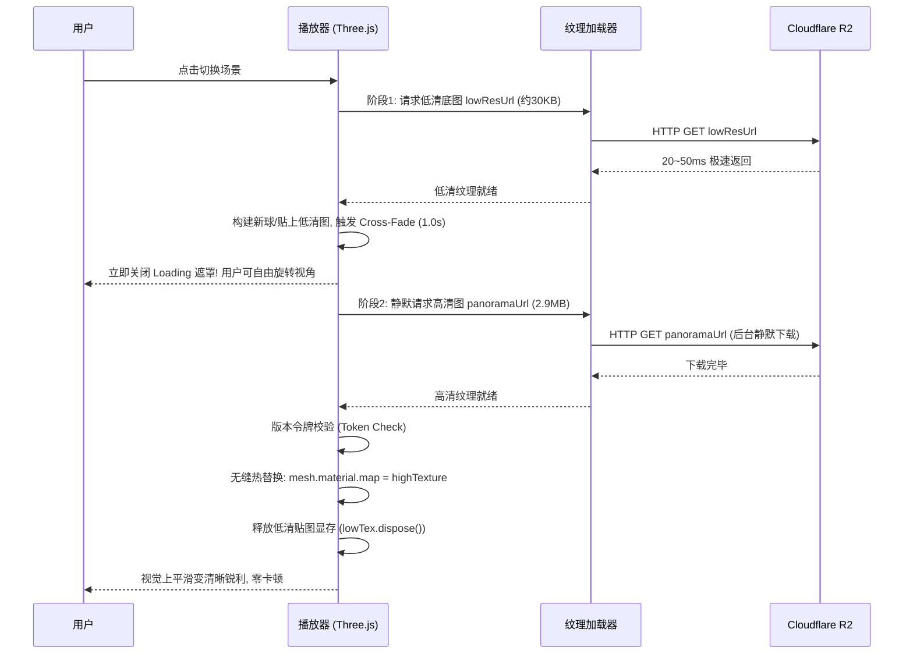

# Three.js 渐进式全景渲染管线与架构设计文档

## 文档版本

| 版本 | 日期 | 变更内容 | 关联分支 |
| :--- | :--- | :--- | :--- |
| v1.1 | 2026-10-09 | 落地双阶段渐进式秒开渲染（LQIP）机制：首屏与场景切换优先加载 30KB 低清贴图并在 0.05s 内解除遮罩响应交互；后台异步拉取 2.9MB 高清贴图无缝热替换升级画质；引入 `currentLoadToken` 防连击串扰。 | `feature/20261009_切片渐进式加载` |
| v1.0 | 2026-10-08 | 初始版本：基于 Three.js 构建 720° 空间漫游；解决全景脚底三脚架穿帮问题，实现 `depthTest: false` 视网膜级 Nadir Patch 遮罩；建立 PC 与移动端双端渲染适配架构。 | `master` |

---
彻底消除全景大图（2.9MB+）下载过程中导致的白屏、长久转圈和交互冻结，达到与行业一线（720云）一致的“瞬间秒开预览、后台静默升格、画质平滑变清晰”的极速体验。

---

## 2. 双阶段渐进式加载（LQIP）管线

### 2.1 渲染时序图

### 2.2 版本令牌机制 (currentLoadToken)
- 痛点：当用户在网络较慢时，快速连续点击多个场景（如场景 A -> 场景 B -> 场景 C）；
- 机制：每次发起加载时 `token = ++currentLoadToken`。当异步纹理下载完成后，严格对比 `currentLoadToken === token`；若不相等，立即 `texture.dispose()` 丢弃，杜绝历史场景贴图覆盖当前场景的串味 BUG。

---

## 3. 显存防护与脚底补地遮罩
- **显存保护**: 双球交叉过渡完成后，必须移除旧网格并对其 `geometry`、`material`、`material.map` 执行递归 `.dispose()`；
- **补地遮罩**: 圆盘放置在全景球体底端 (`y = -radius`)，法线朝上，关闭深度写入 (`depthWrite: false`)，设置高渲染优先级 (`renderOrder = 999`)，实现 100% 完整遮蔽三脚架。

